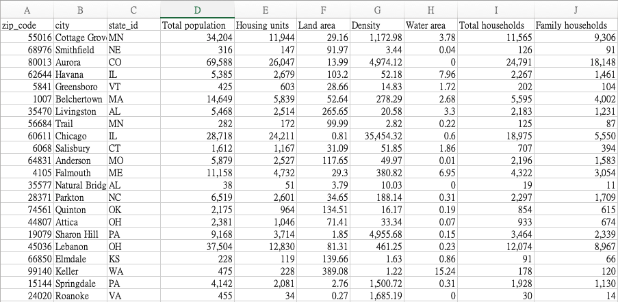

# City-Metadata-Web-Scrapy
Scrape city information from us zip website and output it as a csv file

This project is aiming in web scrapy by querying all city metadata from uszip.com. For each city, we want know their basci information, households, industry, occupation, etc., and output them to a csv file.

There are two phases in this projects. The first one is use all state code (eg. CA) to get all zipcodes, and save this zip code file to a csv for further use.

In the second phase, we will do a data processing. Since a zip code could be located to several cities, it's important to know which city is we are targeting given the zip code. Therefore, we use the city names from zip-code-city-state-county_table.csv and retrieve the default city name from it. In the end, we designed a spider to query all metadata of all cities and output the result with headers and each city as a row to a csv file.

Sample output:


## Installation
You need python 3 and ipython notebok / jupyter notebook to run the python interactive environment. Once they are ready, install all dependencies:
```
pip3 install -r requirements.txt
```

## Usage
Under current folder, run `ipython notebook` and launch the python server. Open the file `get_us_city_metadata-checkpoint.ipynb` and run the scripts.